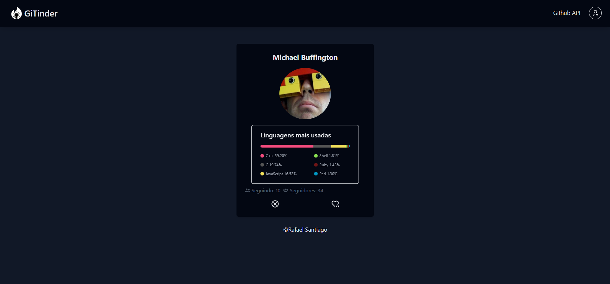

# GiTinder🔥🐈‍⬛

O projeto consiste em uma espécie de frontend do Tinder, só que para devs. Há a opção de curtir os devs e ver um menu com os devs favoritados até então

Visualização: [https://gitinder-seven.vercel.app/](https://gitinder-seven.vercel.app/)

## Tecnologias usadas

